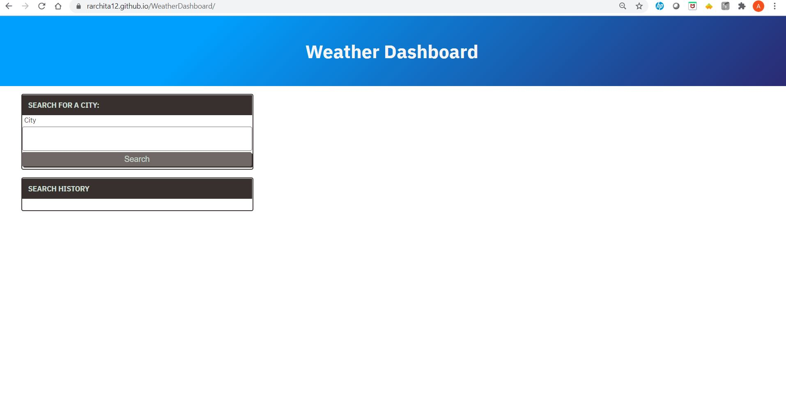
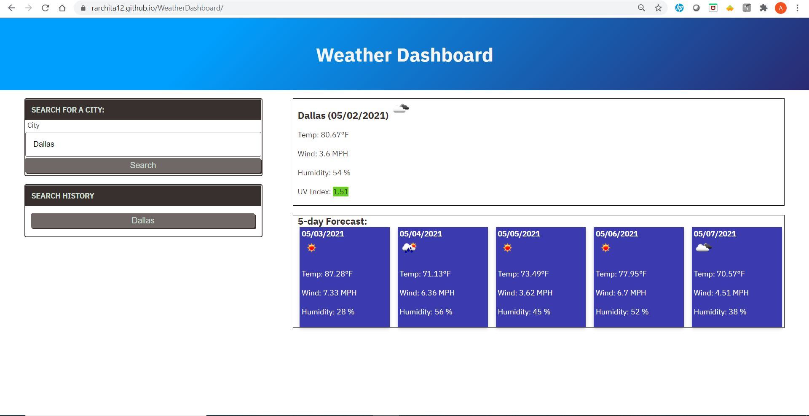
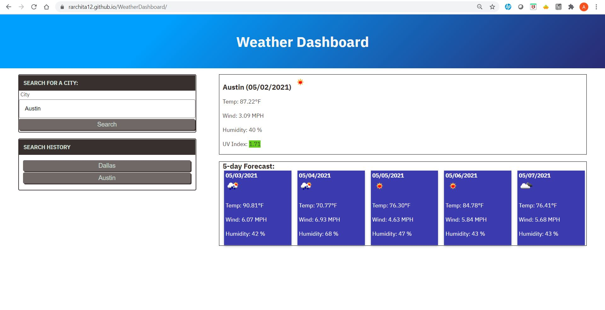
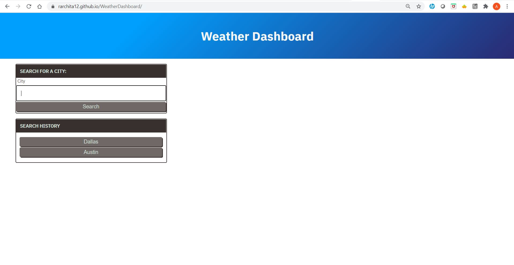

# WeatherDashboard

## Purpose

A website that offers the allows the user to search for a city and displays the current weather conditions as well as the upcoming five day forecast. The user can also look at their past city search history and displays the current and future weather conditons.

## Built With

- HTML
- CSS
- JavaScript
- JQuery
- OpenWeather API
- Moment.js

## Website

https://rarchita12.github.io/Quiz/

## Contribution

Made by Archita
